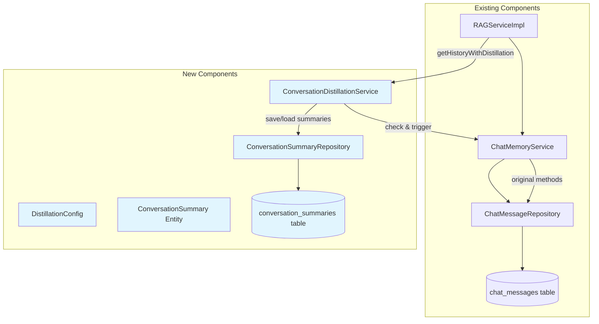
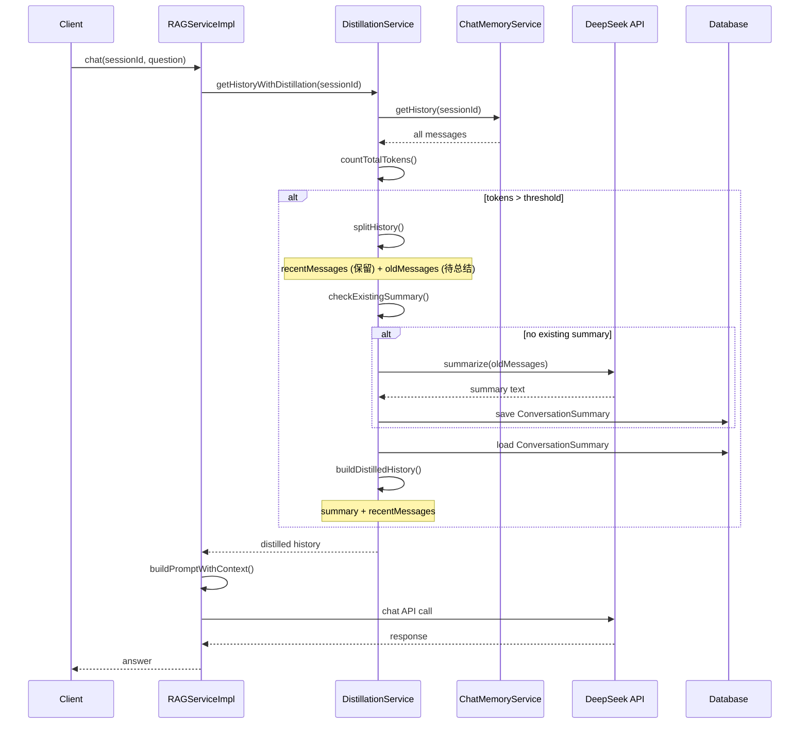

# Design Document: Conversation Distillation

## Overview

对话蒸馏功能用于在对话历史上下文过高时自动对对话进行总结压缩，以减少 Token 消耗。当对话历史的 Token 数量超过阈值时，系统会保留最近的几轮对话，对较早的对话进行 AI 总结压缩，并将摘要存储在数据库中。这确保了长对话的连续性，同时控制了 API 调用成本。

该功能集成到现有的 ChatMemoryService 中，在获取历史记录时自动检测并触发蒸馏，对用户透明。

## Architecture



### Sequence Diagram: Distillation Flow



## Components and Interfaces

### Component 1: ConversationDistillationService

**Purpose**: 核心蒸馏服务，负责检测触发条件、调用 AI 进行总结、管理摘要存储

**Interface**:
```java
public interface ConversationDistillationService {
    
    /**
     * Get conversation history with automatic distillation
     * Returns distilled history if token count exceeds threshold
     * 
     * @param sessionId Session ID
     * @return List of messages (may include summary as synthetic message)
     */
    List<ChatMessage> getHistoryWithDistillation(Long sessionId);
    
    /**
     * Manually trigger distillation for a session
     * 
     * @param sessionId Session ID
     * @return true if distillation was performed
     */
    boolean distillConversation(Long sessionId);
    
    /**
     * Get or create summary for old messages
     * 
     * @param sessionId Session ID
     * @param messages Messages to summarize
     * @return Summary text
     */
    String getOrCreateSummary(Long sessionId, List<ChatMessage> messages);
    
    /**
     * Count total tokens for a list of messages
     * 
     * @param messages List of chat messages
     * @return Total token count
     */
    int countTotalTokens(List<ChatMessage> messages);
    
    /**
     * Check if distillation is needed for a session
     * 
     * @param sessionId Session ID
     * @return true if distillation should be triggered
     */
    boolean needsDistillation(Long sessionId);
}
```

**Responsibilities**:
- 检测对话历史的 Token 数量是否超过阈值
- 分割历史记录：保留最近 N 轮，总结剩余部分
- 调用 DeepSeek API 生成对话摘要
- 管理摘要的存储和检索
- 构建蒸馏后的历史记录（摘要 + 最近对话）

### Component 2: DistillationConfig

**Purpose**: 蒸馏功能的配置类，定义可配置参数

**Interface**:
```java
@Configuration
@ConfigurationProperties(prefix = "app.distillation")
public class DistillationConfig {
    
    /**
     * Token threshold to trigger distillation
     * Default: 4000 tokens
     */
    private int tokenThreshold = 4000;
    
    /**
     * Number of recent message pairs to preserve (not summarize)
     * Default: 3 pairs (6 messages: 3 user + 3 assistant)
     */
    private int preserveRecentPairs = 3;
    
    /**
     * Maximum tokens for summary output
     * Default: 500 tokens
     */
    private int maxSummaryTokens = 500;
    
    /**
     * Enable/disable distillation feature
     * Default: true
     */
    private boolean enabled = true;
    
    /**
     * Model to use for summarization
     * Default: deepseek-chat
     */
    private String summaryModel = "deepseek-chat";
    
    // Getters and Setters
}
```

**Configuration Example (application.yml)**:
```yaml
app:
  distillation:
    enabled: true
    token-threshold: 4000
    preserve-recent-pairs: 3
    max-summary-tokens: 500
    summary-model: deepseek-chat
```

### Component 3: ConversationSummary Entity

**Purpose**: 存储对话摘要的实体类

**Interface**:
```java
@Entity
@Table(name = "conversation_summaries")
public class ConversationSummary {
    
    @Id
    @GeneratedValue(strategy = GenerationType.IDENTITY)
    private Long id;
    
    /**
     * Session ID this summary belongs to
     */
    @Column(name = "session_id", nullable = false, unique = true)
    private Long sessionId;
    
    /**
     * The summary text
     */
    @Column(nullable = false, columnDefinition = "TEXT")
    private String summary;
    
    /**
     * ID of the last message that was summarized
     * Used to determine if summary needs update
     */
    @Column(name = "last_message_id")
    private Long lastMessageId;
    
    /**
     * Token count of the original messages that were summarized
     */
    @Column(name = "original_token_count")
    private Integer originalTokenCount;
    
    /**
     * Token count of the summary
     */
    @Column(name = "summary_token_count")
    private Integer summaryTokenCount;
    
    /**
     * Creation timestamp
     */
    @Column(nullable = false)
    private LocalDateTime createTime;
    
    /**
     * Last update timestamp
     */
    @Column(nullable = false)
    private LocalDateTime updateTime;
    
    @PrePersist
    protected void onCreate() {
        createTime = LocalDateTime.now();
        updateTime = LocalDateTime.now();
    }
    
    @PreUpdate
    protected void onUpdate() {
        updateTime = LocalDateTime.now();
    }
    
    // Constructors, Getters, Setters
}
```

### Component 4: ConversationSummaryRepository

**Purpose**: 摘要数据的持久化接口

**Interface**:
```java
@Repository
public interface ConversationSummaryRepository extends JpaRepository<ConversationSummary, Long> {
    
    /**
     * Find summary by session ID
     */
    Optional<ConversationSummary> findBySessionId(Long sessionId);
    
    /**
     * Delete summary by session ID
     */
    void deleteBySessionId(Long sessionId);
    
    /**
     * Check if summary exists for session
     */
    boolean existsBySessionId(Long sessionId);
}
```

## Data Models

### Model 1: ConversationSummary

```sql
CREATE TABLE IF NOT EXISTS conversation_summaries (
    id BIGINT AUTO_INCREMENT PRIMARY KEY,
    session_id BIGINT NOT NULL UNIQUE,
    summary TEXT NOT NULL,
    last_message_id BIGINT,
    original_token_count INT,
    summary_token_count INT,
    create_time DATETIME NOT NULL,
    update_time DATETIME NOT NULL,
    INDEX idx_session_id (session_id),
    FOREIGN KEY (session_id) REFERENCES conversation_sessions(id) ON DELETE CASCADE
) ENGINE=InnoDB DEFAULT CHARSET=utf8mb4 COLLATE=utf8mb4_unicode_ci;
```

**Validation Rules**:
- `session_id` must be unique (one summary per session)
- `summary` must not be empty
- `original_token_count` must be positive
- `summary_token_count` must be positive and less than `original_token_count`

### Model 2: DistilledHistory (Internal DTO)

```java
/**
 * Internal DTO representing distilled conversation history
 */
public class DistilledHistory {
    
    /**
     * Summary of old messages (may be null if no distillation)
     */
    private String summary;
    
    /**
     * Recent messages preserved without summarization
     */
    private List<ChatMessage> recentMessages;
    
    /**
     * Total token count after distillation
     */
    private int totalTokens;
    
    /**
     * Whether distillation was applied
     */
    private boolean distilled;
    
    // Constructors, Getters, Setters
}
```

## Key Functions with Formal Specifications

### Function 1: getHistoryWithDistillation()

```java
public List<ChatMessage> getHistoryWithDistillation(Long sessionId)
```

**Preconditions:**
- `sessionId` is not null
- Session exists in the database
- `distillationConfig.enabled` is true

**Postconditions:**
- Returns a non-null list of ChatMessage
- If total tokens ≤ threshold, returns original history unchanged
- If total tokens > threshold, returns list containing:
  - One synthetic message with summary (role = "system", content = summary text)
  - Followed by preserved recent messages
- Total tokens of returned list ≤ threshold + maxSummaryTokens
- Original messages remain unchanged in database

**Loop Invariants:** N/A (no loops in this function)

### Function 2: distillConversation()

```java
public boolean distillConversation(Long sessionId)
```

**Preconditions:**
- `sessionId` is not null
- Session has at least `preserveRecentPairs * 2 + 1` messages

**Postconditions:**
- Returns `true` if distillation was performed
- Returns `false` if distillation was not needed or not possible
- If `true`: a new ConversationSummary record exists for this session
- The summary accurately reflects the content of summarized messages
- Summary token count < original token count (compression achieved)

**Loop Invariants:** N/A

### Function 3: getOrCreateSummary()

```java
public String getOrCreateSummary(Long sessionId, List<ChatMessage> messages)
```

**Preconditions:**
- `sessionId` is not null
- `messages` is not null and not empty
- All messages belong to the specified session

**Postconditions:**
- Returns non-null, non-empty summary string
- If existing summary is valid (lastMessageId matches), returns cached summary
- If no valid summary exists:
  - Calls DeepSeek API to generate new summary
  - Saves new ConversationSummary to database
  - Returns the newly generated summary
- Summary accurately represents key information from input messages

**Loop Invariants:** N/A

### Function 4: countTotalTokens()

```java
public int countTotalTokens(List<ChatMessage> messages)
```

**Preconditions:**
- `messages` is not null (may be empty)

**Postconditions:**
- Returns non-negative integer
- Return value equals sum of tokens for all user messages + all assistant replies
- Each message's tokens counted using existing `ChatMemoryService.countTokens()`
- Returns 0 if list is empty

**Loop Invariants:**
- After processing i messages, `totalTokens` equals sum of tokens for first i messages
- `totalTokens` ≥ 0 throughout iteration

### Function 5: splitHistory()

```java
private Pair<List<ChatMessage>, List<ChatMessage>> splitHistory(
    List<ChatMessage> history, int preservePairs)
```

**Preconditions:**
- `history` is not null
- `preservePairs` is positive
- History size ≥ preservePairs * 2

**Postconditions:**
- Returns a Pair where:
  - First element (oldMessages): messages before the preserved section
  - Second element (recentMessages): last `preservePairs * 2` messages
- oldMessages.size() + recentMessages.size() = history.size()
- Order of messages is preserved in both lists
- If history.size() ≤ preservePairs * 2, first element is empty list

**Loop Invariants:**
- Split point is correctly calculated as `history.size() - preservePairs * 2`
- All messages before split point go to oldMessages
- All messages from split point onwards go to recentMessages

## Algorithmic Pseudocode

### Main Processing Algorithm: getHistoryWithDistillation

```pascal
ALGORITHM getHistoryWithDistillation(sessionId)
INPUT: sessionId of type Long
OUTPUT: result of type List<ChatMessage>

BEGIN
  ASSERT sessionId IS NOT NULL
  
  // Step 1: Check if distillation is enabled
  IF NOT distillationConfig.enabled THEN
    RETURN chatMemoryService.getHistory(sessionId)
  END IF
  
  // Step 2: Get all messages for session
  allMessages ← chatMemoryService.getHistory(sessionId)
  
  IF allMessages.isEmpty() THEN
    RETURN allMessages
  END IF
  
  // Step 3: Count total tokens
  totalTokens ← countTotalTokens(allMessages)
  
  // Step 4: Check if distillation needed
  IF totalTokens <= distillationConfig.tokenThreshold THEN
    RETURN allMessages
  END IF
  
  // Step 5: Split history into old and recent
  splitPoint ← allMessages.size() - distillationConfig.preserveRecentPairs * 2
  
  IF splitPoint <= 0 THEN
    // Not enough messages to summarize, return as-is
    RETURN allMessages
  END IF
  
  oldMessages ← allMessages.subList(0, splitPoint)
  recentMessages ← allMessages.subList(splitPoint, allMessages.size())
  
  // Step 6: Get or create summary for old messages
  summary ← getOrCreateSummary(sessionId, oldMessages)
  
  // Step 7: Build distilled history
  result ← new ArrayList<ChatMessage>()
  
  // Create synthetic message for summary
  summaryMessage ← new ChatMessage()
  summaryMessage.setSessionId(sessionId)
  summaryMessage.setUserMessage("[对话历史摘要]")
  summaryMessage.setAssistantReply(summary)
  result.add(summaryMessage)
  
  // Add recent messages
  result.addAll(recentMessages)
  
  ASSERT result.size() = 1 + recentMessages.size()
  
  RETURN result
END
```

**Preconditions:**
- sessionId is valid and session exists
- Distillation configuration is properly loaded

**Postconditions:**
- Returns either original history (if under threshold) or distilled history
- Distilled history contains summary + recent messages
- Token count is reduced

**Loop Invariants:** N/A (main algorithm has no loops)

### Summarization Algorithm: getOrCreateSummary

```pascal
ALGORITHM getOrCreateSummary(sessionId, messages)
INPUT: sessionId of type Long, messages of type List<ChatMessage>
OUTPUT: summary of type String

BEGIN
  ASSERT sessionId IS NOT NULL
  ASSERT messages IS NOT NULL AND NOT messages.isEmpty()
  
  // Step 1: Check for existing summary
  existingSummary ← conversationSummaryRepository.findBySessionId(sessionId)
  
  // Step 2: Check if existing summary is still valid
  lastMessageId ← messages.get(messages.size() - 1).getId()
  
  IF existingSummary.isPresent() THEN
    summary ← existingSummary.get()
    IF summary.getLastMessageId() EQUALS lastMessageId THEN
      // Summary is up-to-date, return cached
      RETURN summary.getSummary()
    END IF
  END IF
  
  // Step 3: Build prompt for summarization
  prompt ← buildSummaryPrompt(messages)
  
  // Step 4: Call DeepSeek API for summarization
  summary ← callSummarizationAPI(prompt)
  
  // Step 5: Calculate token counts
  originalTokens ← countTotalTokens(messages)
  summaryTokens ← chatMemoryService.countTokens(summary)
  
  // Step 6: Save summary to database
  newSummary ← new ConversationSummary()
  newSummary.setSessionId(sessionId)
  newSummary.setSummary(summary)
  newSummary.setLastMessageId(lastMessageId)
  newSummary.setOriginalTokenCount(originalTokens)
  newSummary.setSummaryTokenCount(summaryTokens)
  
  conversationSummaryRepository.save(newSummary)
  
  RETURN summary
END
```

**Preconditions:**
- sessionId and messages are valid
- messages list is not empty
- DeepSeek API is accessible

**Postconditions:**
- Returns non-empty summary string
- New ConversationSummary record exists in database
- summaryTokenCount < originalTokenCount (compression achieved)
- Summary accurately reflects content of messages

**Loop Invariants:** N/A

### Token Counting Algorithm: countTotalTokens

```pascal
ALGORITHM countTotalTokens(messages)
INPUT: messages of type List<ChatMessage>
OUTPUT: totalTokens of type int

BEGIN
  totalTokens ← 0
  
  FOR each message IN messages DO
    // Invariant: totalTokens equals sum of tokens for all processed messages
    ASSERT totalTokens >= 0
    
    userTokens ← chatMemoryService.countTokens(message.getUserMessage())
    assistantTokens ← chatMemoryService.countTokens(message.getAssistantReply())
    
    totalTokens ← totalTokens + userTokens + assistantTokens
  END FOR
  
  ASSERT totalTokens >= 0
  
  RETURN totalTokens
END
```

**Preconditions:**
- messages is not null (may be empty)

**Postconditions:**
- Returns sum of all message tokens
- Returns 0 if list is empty

**Loop Invariants:**
- At start of each iteration: `totalTokens` = sum of tokens for all previously processed messages
- `totalTokens` is always non-negative

## Example Usage

```java
// Example 1: Basic usage in RAGServiceImpl
@Autowired
private ConversationDistillationService distillationService;

public RAGResponse chatWithRAG(Long sessionId, String question) {
    // Get distilled history instead of raw history
    List<ChatMessage> history = distillationService.getHistoryWithDistillation(sessionId);
    
    // Build prompt with distilled history
    String context = buildContext(retrievalService.search(question));
    String reply = callChatApiWithContext(question, context, history);
    
    // Save new message
    chatMemoryService.saveMessage(sessionId, question, reply);
    
    return new RAGResponse(reply, sources, true);
}

// Example 2: Check if distillation is needed
if (distillationService.needsDistillation(sessionId)) {
    boolean distilled = distillationService.distillConversation(sessionId);
    if (distilled) {
        log.info("Conversation distilled for session: {}", sessionId);
    }
}

// Example 3: Manual distillation trigger
@Scheduled(fixedRate = 3600000) // Every hour
public void scheduledDistillation() {
    List<Long> activeSessions = sessionService.getActiveSessions();
    for (Long sessionId : activeSessions) {
        if (distillationService.needsDistillation(sessionId)) {
            distillationService.distillConversation(sessionId);
        }
    }
}
```

## Correctness Properties

*A property is a characteristic or behavior that should hold true across all valid executions of a system-essentially, a formal statement about what the system should do. Properties serve as the bridge between human-readable specifications and machine-verifiable correctness guarantees.*

### Property 1: Token Reduction Guarantee

*For any* conversation session where distillation is triggered, the total token count of the distilled history SHALL be less than the original token count.

**Validates: Requirements 3.3, 5.4**

### Property 2: Recent Messages Preservation

*For any* conversation session with at least `preserveRecentPairs * 2` messages, the distilled history SHALL contain the most recent `preserveRecentPairs * 2` messages unchanged and in their original order.

**Validates: Requirements 2.1, 2.2, 5.3**

### Property 3: Summary Content Preservation

*For any* set of messages summarized, the generated summary SHALL preserve key information including: main topics discussed, decisions made, and context necessary for understanding recent messages.

**Validates: Requirements 3.2**

### Property 4: Idempotent Distillation

*For any* session, calling `getHistoryWithDistillation()` multiple times without new messages being added SHALL return the same result without creating duplicate summaries.

**Validates: Requirements 4.3, 4.4**

### Property 5: Summary Freshness

*For any* session, when new messages are added after an existing summary, the next distillation SHALL update the summary to include the newly summarized content.

**Validates: Requirements 4.5**

### Property 6: Threshold Trigger Condition

*For any* session, distillation SHALL only be triggered when the total token count exceeds the configured `tokenThreshold`.

**Validates: Requirements 1.1, 1.2**

### Property 7: Summary Token Bound

*For any* generated summary, the summary token count SHALL not exceed the configured `maxSummaryTokens`.

**Validates: Requirements 3.4**

### Property 8: Token Counting Consistency

*For any* text content, the token counting method SHALL produce the same result when called multiple times with the same input, and the result SHALL be non-negative.

**Validates: Requirements 1.3, 1.4**

### Property 9: Graceful Degradation on API Failure

*For any* session where the DeepSeek API call fails, the system SHALL return the original history unchanged without throwing exceptions.

**Validates: Requirements 3.5, 8.1**

### Property 10: Minimum Message Threshold

*For any* session with fewer than `preserveRecentPairs * 2 + 1` messages, distillation SHALL NOT be performed.

**Validates: Requirements 2.3, 2.4**

## Error Handling

### Error Scenario 1: DeepSeek API Unavailable

**Condition**: When calling DeepSeek API for summarization fails
**Response**: 
- Log the error with session ID and message count
- Return original history without distillation
- Do not block the conversation flow
**Recovery**: 
- Retry on next distillation check
- Consider fallback to simple truncation if API is persistently unavailable

### Error Scenario 2: Summary Storage Failure

**Condition**: When saving ConversationSummary to database fails
**Response**:
- Log the error
- Continue with in-memory summary (don't persist)
- Return distilled history to not block conversation
**Recovery**:
- Retry saving on next distillation
- Check database connection health

### Error Scenario 3: Invalid Session

**Condition**: When sessionId is null or doesn't exist
**Response**:
- Return empty list for getHistoryWithDistillation
- Return false for distillConversation
- Log warning for invalid session access
**Recovery**:
- No recovery needed - this is a client error

### Error Scenario 4: Insufficient Messages for Distillation

**Condition**: When history has fewer than `preserveRecentPairs * 2 + 1` messages
**Response**:
- Return original history without distillation
- Log at debug level (expected condition, not an error)
**Recovery**:
- No recovery needed - wait for more messages

## Testing Strategy

### Unit Testing Approach

- Test each method of ConversationDistillationService in isolation
- Mock dependencies: ChatMemoryService, ConversationSummaryRepository, DeepSeek API
- Focus on boundary conditions and edge cases
- Target coverage: 80%+

**Key Test Cases**:
- `getHistoryWithDistillation` with history under threshold → returns original
- `getHistoryWithDistillation` with history over threshold → returns distilled
- `countTotalTokens` with empty list → returns 0
- `countTotalTokens` with mixed Chinese/English → accurate count
- `splitHistory` with various sizes → correct split

### Property-Based Testing Approach

**Property Test Library**: jqwik (Java)

- Test token counting accuracy across various text patterns
- Test summary compression ratio bounds
- Test that distilled history never exceeds threshold + maxSummaryTokens

### Integration Testing Approach

- Test with real database (H2 in-memory for tests)
- Test with mocked DeepSeek API responses
- Test full distillation flow end-to-end
- Verify summary storage and retrieval

## Performance Considerations

- **Token Counting**: Current approximation is O(n) where n is text length. Consider caching token counts in ChatMessage entity for frequently accessed messages.

- **API Calls**: Each distillation requires one DeepSeek API call. To minimize cost:
  - Cache summaries and only regenerate when new messages are added
  - Use cheaper model (deepseek-chat) for summarization
  - Consider batch processing for multiple sessions

- **Database Queries**: 
  - Add index on `session_id` in conversation_summaries table
  - Consider lazy loading of summaries

- **Memory**: 
  - Process messages in batches if history is very large
  - Consider streaming for summary generation

## Security Considerations

- **API Key Protection**: DeepSeek API key is stored in environment variables, not in code
- **Input Validation**: Validate sessionId to prevent SQL injection
- **Summary Content**: Summary may contain sensitive conversation data - ensure proper access controls
- **Rate Limiting**: Consider rate limiting distillation API calls to prevent abuse

## Dependencies

- **Existing Dependencies**:
  - Spring Boot 3.x
  - Spring Data JPA
  - MySQL Connector
  - OkHttp (for DeepSeek API calls)
  - Jackson (for JSON processing)

- **New Dependencies**:
  - None required (uses existing infrastructure)

- **External Services**:
  - DeepSeek API (for summarization)
    - Same API key as main chat functionality
    - Endpoint: `/v1/chat/completions`
    - Model: `deepseek-chat`
