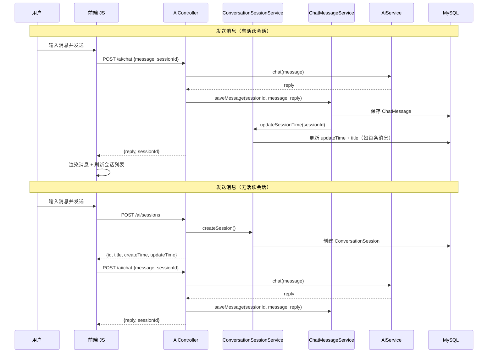
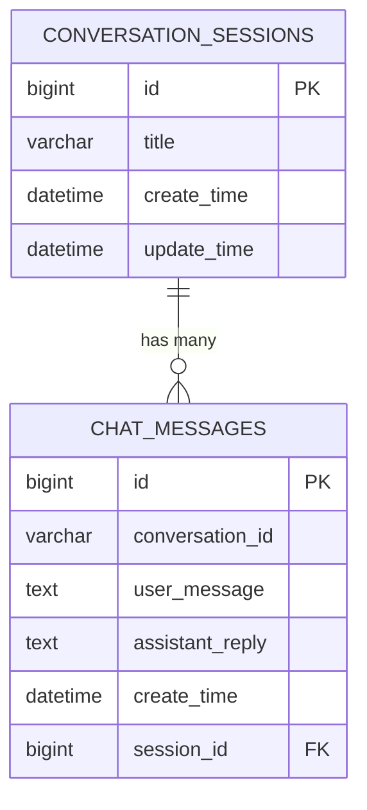

# 设计文档：对话会话分组功能

## 概述

本设计为 AI 聊天应用引入对话会话（Conversation Session）分组功能。核心思路是新增 `ConversationSession` JPA 实体，并在现有 `ChatMessage` 实体上添加 `sessionId` 外键（nullable 以兼容历史数据），通过新增 REST API 端点和前端 JavaScript 逻辑实现会话的创建、切换、消息归组和页面刷新恢复。

### 设计决策

1. **sessionId 设为 nullable**：兼容已有无会话归属的历史消息，避免数据迁移风险。
2. **会话标题自动生成**：取第一条用户消息的前 30 个字符，无需用户手动输入。
3. **前端状态管理使用 JS 变量**：不引入框架，保持纯 HTML/CSS/JS 的技术栈一致性，用 `currentSessionId` 变量跟踪当前活跃会话。
4. **JPA `ddl-auto=update` 自动建表**：利用现有配置，Hibernate 自动创建 `conversation_sessions` 表和更新 `chat_messages` 表结构。

## 架构

```mermaid
graph TB
    subgraph Frontend["前端 (index.html)"]
        UI[页面 UI]
        JS[JavaScript 逻辑]
    end

    subgraph Backend["后端 (Spring Boot)"]
        AC[AiController]
        SMS[ConversationSessionService]
        CMS[ChatMessageService]
        AIS[AiService]
        CSR[ConversationSessionRepository]
        CMR[ChatMessageRepository]
    end

    subgraph Database["MySQL"]
        CST[conversation_sessions 表]
        CMT[chat_messages 表]
    end

    UI --> JS
    JS -->|POST /ai/sessions| AC
    JS -->|GET /ai/sessions| AC
    JS -->|GET /ai/sessions/{id}/messages| AC
    JS -->|POST /ai/chat| AC

    AC --> SMS
    AC --> CMS
    AC --> AIS

    SMS --> CSR
    CMS --> CMR

    CSR --> CST
    CMR --> CMT
    CMT -->|sessionId FK| CST
```

### 请求流程



## 组件与接口

### 1. ConversationSession 实体

新增 JPA 实体，映射到 `conversation_sessions` 表。

```java
@Entity
@Table(name = "conversation_sessions")
public class ConversationSession {
    @Id
    @GeneratedValue(strategy = GenerationType.IDENTITY)
    private Long id;

    @Column(length = 100)
    private String title;

    @Column(nullable = false)
    private LocalDateTime createTime;

    @Column(nullable = false)
    private LocalDateTime updateTime;
}
```

### 2. ChatMessage 实体修改

在现有 `ChatMessage` 实体上添加 `sessionId` 字段。

```java
// 新增字段
@Column(name = "session_id")
private Long sessionId;
```

- `sessionId` 为 nullable，兼容历史数据。
- 不使用 `@ManyToOne` 关联，保持简单的外键引用，避免序列化循环和懒加载问题。

### 3. ConversationSessionRepository

```java
@Repository
public interface ConversationSessionRepository extends JpaRepository<ConversationSession, Long> {
    List<ConversationSession> findAllByOrderByUpdateTimeDesc();
    Optional<ConversationSession> findTopByOrderByUpdateTimeDesc();
}
```

### 4. ChatMessageRepository 修改

新增按 sessionId 查询的方法：

```java
List<ChatMessage> findBySessionIdOrderByCreateTimeAsc(Long sessionId);
```

### 5. ConversationSessionService（新增）

```java
@Service
public class ConversationSessionService {
    ConversationSession createSession();                    // 创建空会话
    List<ConversationSession> getAllSessions();              // 获取所有会话（按 updateTime 倒序）
    Optional<ConversationSession> getLatestSession();       // 获取最近更新的会话
    void updateSessionOnNewMessage(Long sessionId, String userMessage); // 更新 updateTime，首条消息时设置 title
}
```

### 6. ChatMessageService 修改

修改 `saveMessage` 方法签名，支持 `sessionId` 参数：

```java
public ChatMessage saveMessage(Long sessionId, String userMessage, String assistantReply);
public List<ChatMessage> getMessagesBySessionId(Long sessionId);
```

### 7. AiController 新增/修改接口

| 方法 | 路径 | 说明 | 请求体/参数 | 响应 |
|------|------|------|-------------|------|
| POST | `/ai/sessions` | 创建新会话 | 无 | `ConversationSession` JSON |
| GET | `/ai/sessions` | 获取所有会话列表 | 无 | `List<ConversationSession>` JSON |
| GET | `/ai/sessions/{sessionId}/messages` | 获取指定会话的消息 | `sessionId` 路径参数 | `List<ChatMessage>` JSON |
| POST | `/ai/chat` | 发送消息（修改） | `{message, sessionId}` | `{reply, sessionId}` |

### 8. DTO 修改

**AiRequest** 新增字段：
```java
private Long sessionId;
```

**AiResponse** 新增字段：
```java
private Long sessionId;
```

### 9. 前端 JavaScript 逻辑

核心状态变量：
- `currentSessionId`：当前活跃会话 ID，null 表示无活跃会话

核心函数修改/新增：
- `loadSessions()`：页面加载时获取会话列表并渲染侧边栏
- `createNewSession()`：调用 POST /ai/sessions 创建新会话
- `switchSession(sessionId)`：切换会话，加载对应消息
- `sendMessage()`：修改为携带 `sessionId`，无活跃会话时先创建
- `renderSessionList(sessions)`：渲染侧边栏会话列表
- `loadChatHistory()`：改为加载当前会话消息而非全部消息

## 数据模型

### conversation_sessions 表

| 字段 | 类型 | 约束 | 说明 |
|------|------|------|------|
| id | BIGINT | PK, AUTO_INCREMENT | 主键 |
| title | VARCHAR(100) | nullable | 会话标题 |
| create_time | DATETIME | NOT NULL | 创建时间 |
| update_time | DATETIME | NOT NULL | 最后更新时间 |

### chat_messages 表（修改）

| 字段 | 类型 | 约束 | 说明 |
|------|------|------|------|
| session_id | BIGINT | nullable | 外键，关联 conversation_sessions.id |

新增 `session_id` 列，nullable 以兼容历史数据。

### ER 关系图




## 正确性属性

*属性是指在系统所有有效执行中都应成立的特征或行为——本质上是对系统应做什么的形式化陈述。属性是人类可读规范与机器可验证正确性保证之间的桥梁。*

### 属性 1：保存消息更新会话时间戳

*对于任意* 已存在的 ConversationSession 和任意有效的用户消息，当消息被保存到该会话后，该会话的 updateTime 应大于等于消息保存前的 updateTime。

**验证需求：1.4**

### 属性 2：首条消息设置会话标题

*对于任意* 非空用户消息字符串，当该消息作为某个 ConversationSession 的第一条消息被保存时，该会话的 title 应等于该消息的前 min(30, 消息长度) 个字符。

**验证需求：1.5**

### 属性 3：消息正确关联到会话

*对于任意* 有效的 sessionId 和任意用户消息，当消息通过 POST /ai/chat 接口发送并指定该 sessionId 时，保存后的 ChatMessage 的 sessionId 应等于请求中指定的 sessionId。

**验证需求：3.2**

### 属性 4：会话列表按更新时间倒序排列

*对于任意* 一组 ConversationSession 记录，通过 GET /ai/sessions 接口返回的列表中，每个会话的 updateTime 应大于等于其后续会话的 updateTime。

**验证需求：4.1**

### 属性 5：会话消息按创建时间升序排列

*对于任意* ConversationSession 及其关联的一组 ChatMessage 记录，通过 GET /ai/sessions/{sessionId}/messages 接口返回的列表中，每条消息的 createTime 应小于等于其后续消息的 createTime。

**验证需求：5.2**

### 属性 6：会话列表仅包含有效会话记录

*对于任意* 数据库状态（包含有 sessionId 和无 sessionId 的 ChatMessage），通过 GET /ai/sessions 接口返回的列表中，每一项都应是一个有效的 ConversationSession 记录，不应包含无会话归属的历史消息。

**验证需求：7.3**

## 错误处理

### 后端错误处理

| 场景 | 处理方式 | HTTP 状态码 |
|------|----------|-------------|
| 创建会话失败（数据库异常） | 返回错误信息 | 500 |
| 发送消息时 sessionId 对应的会话不存在 | 返回错误提示 | 404 |
| 发送消息时 AI 服务调用失败 | 返回友好错误信息（保持现有行为） | 200（body 中包含错误信息） |
| 获取会话消息时 sessionId 无效 | 返回空列表 | 200 |
| 获取会话列表时数据库异常 | 返回错误信息 | 500 |

### 前端错误处理

| 场景 | 处理方式 |
|------|----------|
| 创建会话接口调用失败 | 显示错误提示，允许重试 |
| 加载会话列表失败 | 控制台打印错误，侧边栏显示空状态 |
| 加载会话消息失败 | 控制台打印错误，聊天区域显示空状态 |
| 发送消息时自动创建会话失败 | 显示错误提示，不发送消息 |
| 页面刷新恢复会话失败 | 显示空状态，等待用户操作 |

## 测试策略

### 双重测试方法

本功能采用单元测试 + 属性测试的双重策略：

- **单元测试**：验证具体示例、边界条件和错误场景
- **属性测试**：验证跨所有输入的通用属性

### 属性测试配置

- 使用 **jqwik**（Java 属性测试库，兼容 JUnit 5，支持 Java 8）
- 每个属性测试最少运行 **100 次迭代**
- 每个属性测试通过注释引用设计文档中的属性
- 标签格式：**Feature: conversation-sessions, Property {number}: {属性描述}**

### 单元测试覆盖

| 测试类 | 覆盖范围 |
|--------|----------|
| `ConversationSessionServiceTest` | 创建会话、获取会话列表、获取最新会话、更新会话时间和标题 |
| `ChatMessageServiceTest` | 保存消息（带 sessionId）、按 sessionId 查询消息 |
| `AiControllerTest` | 新增 API 端点的请求/响应验证、错误场景 |

### 属性测试覆盖

| 属性 | 测试内容 |
|------|----------|
| 属性 1 | 随机生成会话和消息，验证 updateTime 更新 |
| 属性 2 | 随机生成不同长度的用户消息字符串，验证 title 截取逻辑 |
| 属性 3 | 随机生成 sessionId 和消息，验证关联正确性 |
| 属性 4 | 随机生成多个会话（不同 updateTime），验证排序不变量 |
| 属性 5 | 随机生成多条消息（不同 createTime），验证排序不变量 |
| 属性 6 | 随机生成混合数据（有/无 sessionId 的消息），验证过滤正确性 |

### 集成测试

- 使用 `@SpringBootTest` + `@AutoConfigureMockMvc` 进行 API 集成测试
- 验证完整的请求-响应流程
- 验证数据库持久化正确性

### 前端测试

- 手动测试 UI 交互流程（创建会话、切换会话、发送消息、页面刷新恢复）
- 验证侧边栏会话列表渲染和高亮状态
- 验证空状态提示显示
