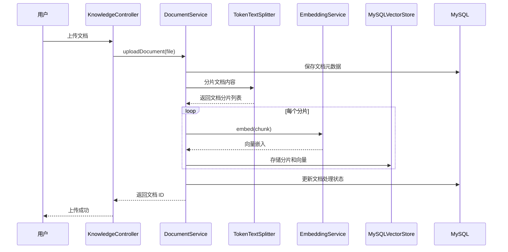
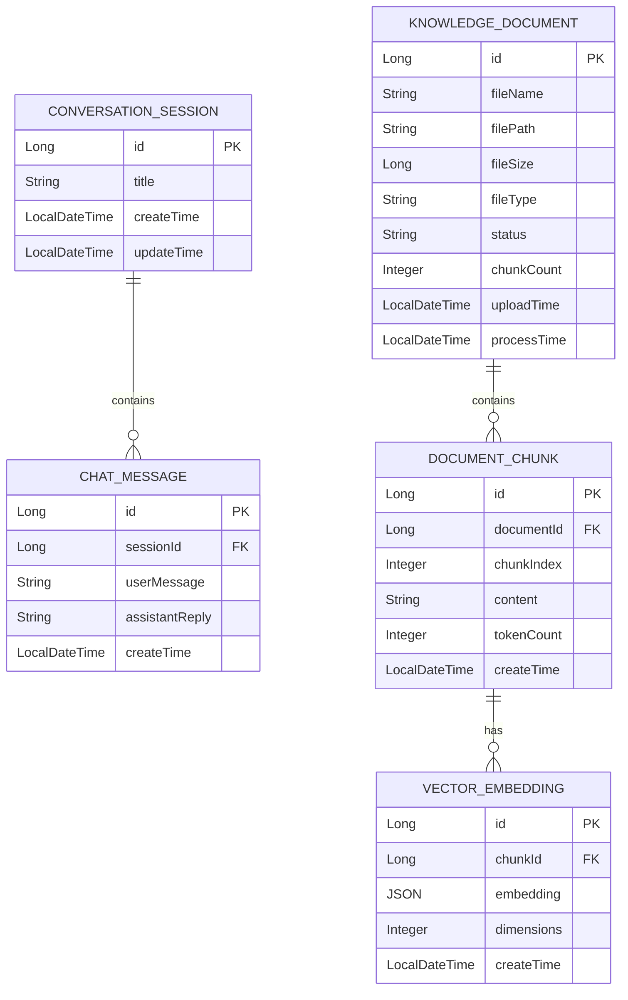

# 设计文档：LangChain 和 RAG 优化功能

## 概述

本设计文档描述了为现有 AI 聊天应用添加 LangChain 和 RAG（检索增强生成）优化功能的技术实现方案。该功能将实现多轮对话记忆、知识库文档管理、文档分片与向量化、相似度检索以及 RAG 增强对话等核心能力。

### 关键技术决策

1. **框架升级**：从 Spring Boot 2.7.18 + Java 8 升级到 Spring Boot 3.2.0+ + Java 17，以满足 Spring AI 框架要求
2. **Spring AI 集成**：使用 Spring AI 框架标准化 AI 功能实现，提供统一的 ChatClient、EmbeddingModel 和 VectorStore 接口
3. **MySQL 向量存储**：实现自定义的 MySQL VectorStore，使用 JSON 类型存储向量嵌入，避免引入额外的向量数据库
4. **DeepSeek API**：继续使用 DeepSeek API 作为聊天和嵌入模型服务

### 系统架构图

```mermaid
graph TB
    subgraph Frontend["前端层"]
        UI[聊天界面]
        KB[知识库管理界面]
    end

    subgraph Controller["控制器层"]
        ChatController[ChatController]
        KnowledgeController[KnowledgeController]
    end

    subgraph Service["服务层"]
        RAGService[RAGService]
        ChatMemoryService[ChatMemoryService]
        DocumentService[DocumentService]
        EmbeddingService[EmbeddingService]
        RetrievalService[RetrievalService]
    end

    subgraph SpringAI["Spring AI 层"]
        ChatClient[ChatClient]
        EmbeddingModel[EmbeddingModel]
        VectorStore[MySQLVectorStore]
        TextSplitter[TokenTextSplitter]
    end

    subgraph Storage["存储层"]
        MySQL[(MySQL 数据库)]
        FileStorage[文件存储]
    end

    subgraph External["外部服务"]
        DeepSeek[DeepSeek API]
    end

    UI --> ChatController
    KB --> KnowledgeController
    ChatController --> RAGService
    KnowledgeController --> DocumentService
    RAGService --> ChatMemoryService
    RAGService --> RetrievalService
    RAGService --> ChatClient
    DocumentService --> TextSplitter
    TextSplitter --> EmbeddingService
    EmbeddingService --> EmbeddingModel
    RetrievalService --> VectorStore
    ChatClient --> DeepSeek
    EmbeddingModel --> DeepSeek
    VectorStore --> MySQL
    ChatMemoryService --> MySQL
    DocumentService --> FileStorage
    DocumentService --> MySQL


## 架构

### 整体架构

系统采用分层架构设计，从上到下分为：前端层、控制器层、服务层、Spring AI 集成层和存储层。

### 核心组件交互流程

#### RAG 增强对话流程

```mermaid
sequenceDiagram
    participant User as 用户
    participant Controller as ChatController
    participant RAG as RAGService
    participant Memory as ChatMemoryService
    participant Retrieval as RetrievalService
    participant Embed as EmbeddingService
    participant Vector as MySQLVectorStore
    participant Chat as ChatClient
    participant DeepSeek as DeepSeek API

    User->>Controller: 发送问题
    Controller->>RAG: chatWithRAG(sessionId, question)
    RAG->>Memory: getHistory(sessionId)
    Memory-->>RAG: 返回历史消息
    RAG->>Retrieval: search(question)
    Retrieval->>Embed: embed(question)
    Embed->>DeepSeek: embedding API
    DeepSeek-->>Embed: 向量嵌入
    Embed-->>Retrieval: 向量嵌入
    Retrieval->>Vector: similaritySearch(embedding)
    Vector-->>Retrieval: 相似文档分片
    Retrieval-->>RAG: 相关上下文
    RAG->>Chat: chat(prompt with context)
    Chat->>DeepSeek: chat API
    DeepSeek-->>Chat: AI 回复
    Chat-->>RAG: 回复内容
    RAG->>Memory: saveMessage(sessionId, question, reply)
    RAG-->>Controller: 回复结果
    Controller-->>User: 返回回复
```

#### 文档上传与处理流程



### 技术栈升级说明

| 组件 | 当前版本 | 目标版本 | 升级原因 |
|------|----------|----------|----------|
| Spring Boot | 2.7.18 | 3.2.0+ | Spring AI 要求 |
| Java | 8 | 17+ | Spring Boot 3.x 要求 |
| Spring AI | 无 | 1.0.0+ | AI 功能标准化 |
| Jakarta EE | javax.* | jakarta.* | Spring Boot 3.x 要求 |

## 组件和接口

### 1. ChatMemoryService（多轮对话记忆服务）

**职责**：管理多轮对话历史，提供上下文记忆能力

**接口定义**：

```java
public interface ChatMemoryService {
    
    /**
     * 获取会话的历史消息
     * @param sessionId 会话ID
     * @return 历史消息列表
     */
    List<ChatMessage> getHistory(Long sessionId);
    
    /**
     * 获取限制 token 数后的历史消息
     * @param sessionId 会话ID
     * @param maxTokens 最大 token 数
     * @return 截断后的历史消息列表
     */
    List<ChatMessage> getHistoryWithTokenLimit(Long sessionId, int maxTokens);
    
    /**
     * 保存消息到会话历史
     * @param sessionId 会话ID
     * @param userMessage 用户消息
     * @param assistantReply AI 回复
     */
    void saveMessage(Long sessionId, String userMessage, String assistantReply);
    
    /**
     * 清空会话历史
     * @param sessionId 会话ID
     */
    void clearHistory(Long sessionId);
    
    /**
     * 计算文本的 token 数量
     * @param text 文本内容
     * @return token 数量
     */
    int countTokens(String text);
}
```

**实现要点**：
- 使用现有的 `ChatMessage` 实体和 `ChatMessageRepository`
- Token 计算使用 TikToken 库或近似算法
- 历史消息按时间倒序保留，超出限制时删除最早的消息

### 2. DocumentService（文档管理服务）

**职责**：管理知识库文档的上传、存储、分片和删除

**接口定义**：

```java
public interface DocumentService {
    
    /**
     * 上传文档
     * @param file 文件
     * @return 文档元数据
     */
    KnowledgeDocument uploadDocument(MultipartFile file);
    
    /**
     * 获取所有文档列表
     * @return 文档列表
     */
    List<KnowledgeDocument> getAllDocuments();
    
    /**
     * 获取文档详情
     * @param documentId 文档ID
     * @return 文档详情
     */
    Optional<KnowledgeDocument> getDocument(Long documentId);
    
    /**
     * 删除文档及其分片
     * @param documentId 文档ID
     */
    void deleteDocument(Long documentId);
    
    /**
     * 获取文档的所有分片
     * @param documentId 文档ID
     * @return 分片列表
     */
    List<DocumentChunk> getDocumentChunks(Long documentId);
    
    /**
     * 处理文档（分片和向量化）
     * @param documentId 文档ID
     */
    void processDocument(Long documentId);
}
```

**支持的文档格式**：
- PDF：使用 Apache PDFBox 解析
- TXT：直接读取文本
- MD：直接读取 Markdown 文本
- DOCX：使用 Apache POI 解析

### 3. EmbeddingService（向量化服务）

**职责**：调用 Embedding 模型生成文本的向量嵌入

**接口定义**：

```java
public interface EmbeddingService {
    
    /**
     * 生成单个文本的向量嵌入
     * @param text 文本内容
     * @return 向量嵌入
     */
    float[] embed(String text);
    
    /**
     * 批量生成向量嵌入
     * @param texts 文本列表
     * @return 向量嵌入列表
     */
    List<float[]> embedBatch(List<String> texts);
    
    /**
     * 获取向量维度
     * @return 向量维度
     */
    int getDimensions();
}
```

**实现要点**：
- 使用 Spring AI 的 `EmbeddingModel` 接口
- 默认使用 DeepSeek Embedding API
- 支持配置 OpenAI Embedding API 作为备选
- 实现向量缓存以避免重复计算

### 4. RetrievalService（检索服务）

**职责**：执行相似度搜索，检索相关文档分片

**接口定义**：

```java
public interface RetrievalService {
    
    /**
     * 执行相似度搜索
     * @param query 查询文本
     * @return 相关文档分片列表
     */
    List<RetrievalResult> search(String query);
    
    /**
     * 执行相似度搜索（带参数）
     * @param query 查询文本
     * @param topK 返回数量
     * @param threshold 相似度阈值
     * @return 相关文档分片列表
     */
    List<RetrievalResult> search(String query, int topK, double threshold);
}
```

**RetrievalResult 数据结构**：

```java
public class RetrievalResult {
    private Long chunkId;
    private String content;
    private double similarityScore;
    private Long documentId;
    private String documentName;
    private int chunkIndex;
}
```

### 5. RAGService（RAG 增强对话服务）

**职责**：整合检索和对话能力，提供 RAG 增强的对话功能

**接口定义**：

```java
public interface RAGService {
    
    /**
     * RAG 增强对话
     * @param sessionId 会话ID
     * @param question 用户问题
     * @return AI 回复
     */
    RAGResponse chatWithRAG(Long sessionId, String question);
    
    /**
     * 构建带上下文的提示词
     * @param systemPrompt 系统提示
     * @param context 检索上下文
     * @param history 对话历史
     * @param question 用户问题
     * @return 完整提示词
     */
    String buildPrompt(String systemPrompt, String context, 
                       List<ChatMessage> history, String question);
}
```

**RAGResponse 数据结构**：

```java
public class RAGResponse {
    private String reply;
    private List<SourceReference> sources;
    private boolean fromKnowledgeBase;
}

public class SourceReference {
    private Long documentId;
    private String documentName;
    private String chunkContent;
    private double similarityScore;
}
```

### 6. MySQLVectorStore（MySQL 向量存储）

**职责**：实现 Spring AI 的 `VectorStore` 接口，使用 MySQL 存储向量数据

**接口定义**：

```java
public class MySQLVectorStore implements VectorStore {
    
    /**
     * 添加文档到向量存储
     * @param documents 文档列表
     */
    @Override
    void add(List<Document> documents);
    
    /**
     * 删除文档
     * @param idList 文档ID列表
     */
    @Override
    void delete(List<String> idList);
    
    /**
     * 相似度搜索
     * @param request 搜索请求
     * @return 相似文档列表
     */
    @Override
    List<Document> similaritySearch(SearchRequest request);
    
    /**
     * 按文档ID批量删除向量
     * @param documentId 文档ID
     */
    void deleteByDocumentId(Long documentId);
    
    /**
     * 计算余弦相似度
     * @param vector1 向量1
     * @param vector2 向量2
     * @return 相似度分数
     */
    double cosineSimilarity(float[] vector1, float[] vector2);
}
```

**实现要点**：
- 向量数据使用 JSON 类型存储
- 相似度计算在应用层实现（余弦相似度）
- 支持按文档 ID 批量删除

### 7. REST API 控制器

**KnowledgeController**：

```java
@RestController
@RequestMapping("/api/knowledge")
public class KnowledgeController {
    
    @PostMapping("/documents")
    ResponseEntity<DocumentUploadResponse> uploadDocument(
        @RequestParam("file") MultipartFile file);
    
    @GetMapping("/documents")
    List<KnowledgeDocument> getAllDocuments();
    
    @GetMapping("/documents/{id}")
    ResponseEntity<KnowledgeDocument> getDocument(@PathVariable Long id);
    
    @DeleteMapping("/documents/{id}")
    ResponseEntity<Void> deleteDocument(@PathVariable Long id);
    
    @GetMapping("/documents/{id}/chunks")
    List<DocumentChunk> getDocumentChunks(@PathVariable Long id);
}
```

**RAGController**：

```java
@RestController
@RequestMapping("/api/chat")
public class RAGController {
    
    @PostMapping("/rag")
    RAGResponse chatWithRAG(@RequestBody RAGRequest request);
}
```

## 数据模型

### 实体关系图



### 实体定义

#### KnowledgeDocument（知识库文档）

```java
@Entity
@Table(name = "knowledge_documents")
public class KnowledgeDocument {
    
    @Id
    @GeneratedValue(strategy = GenerationType.IDENTITY)
    private Long id;
    
    @Column(nullable = false)
    private String fileName;
    
    @Column(nullable = false)
    private String filePath;
    
    @Column(nullable = false)
    private Long fileSize;
    
    @Column(nullable = false, length = 20)
    private String fileType; // PDF, TXT, MD, DOCX
    
    @Column(nullable = false, length = 20)
    private String status; // PENDING, PROCESSING, COMPLETED, FAILED
    
    private Integer chunkCount;
    
    @Column(nullable = false)
    private LocalDateTime uploadTime;
    
    private LocalDateTime processTime;
    
    private String errorMessage;
}
```

#### DocumentChunk（文档分片）

```java
@Entity
@Table(name = "document_chunks")
public class DocumentChunk {
    
    @Id
    @GeneratedValue(strategy = GenerationType.IDENTITY)
    private Long id;
    
    @Column(name = "document_id", nullable = false)
    private Long documentId;
    
    @Column(name = "chunk_index", nullable = false)
    private Integer chunkIndex;
    
    @Column(nullable = false, columnDefinition = "TEXT")
    private String content;
    
    @Column(name = "token_count")
    private Integer tokenCount;
    
    @Column(nullable = false)
    private LocalDateTime createTime;
}
```

#### VectorEmbedding（向量嵌入）

```java
@Entity
@Table(name = "vector_embeddings")
public class VectorEmbedding {
    
    @Id
    @GeneratedValue(strategy = GenerationType.IDENTITY)
    private Long id;
    
    @Column(name = "chunk_id", nullable = false, unique = true)
    private Long chunkId;
    
    @Column(nullable = false, columnDefinition = "JSON")
    private String embedding; // JSON 数组存储向量
    
    @Column(nullable = false)
    private Integer dimensions;
    
    @Column(nullable = false)
    private LocalDateTime createTime;
}
```

### 数据库表结构

```sql
-- 知识库文档表
CREATE TABLE knowledge_documents (
    id BIGINT AUTO_INCREMENT PRIMARY KEY,
    file_name VARCHAR(255) NOT NULL,
    file_path VARCHAR(500) NOT NULL,
    file_size BIGINT NOT NULL,
    file_type VARCHAR(20) NOT NULL,
    status VARCHAR(20) NOT NULL DEFAULT 'PENDING',
    chunk_count INT DEFAULT 0,
    upload_time DATETIME NOT NULL,
    process_time DATETIME,
    error_message TEXT,
    INDEX idx_status (status),
    INDEX idx_upload_time (upload_time)
);

-- 文档分片表
CREATE TABLE document_chunks (
    id BIGINT AUTO_INCREMENT PRIMARY KEY,
    document_id BIGINT NOT NULL,
    chunk_index INT NOT NULL,
    content TEXT NOT NULL,
    token_count INT,
    create_time DATETIME NOT NULL,
    INDEX idx_document_id (document_id),
    FOREIGN KEY (document_id) REFERENCES knowledge_documents(id) ON DELETE CASCADE
);

-- 向量嵌入表
CREATE TABLE vector_embeddings (
    id BIGINT AUTO_INCREMENT PRIMARY KEY,
    chunk_id BIGINT NOT NULL UNIQUE,
    embedding JSON NOT NULL,
    dimensions INT NOT NULL,
    create_time DATETIME NOT NULL,
    INDEX idx_chunk_id (chunk_id),
    FOREIGN KEY (chunk_id) REFERENCES document_chunks(id) ON DELETE CASCADE
);
```

## 正确性属性

*属性是系统在所有有效执行中应保持的特征或行为——本质上是关于系统应该做什么的形式化陈述。属性作为人类可读规范与机器可验证正确性保证之间的桥梁。*

### 属性 1：会话历史加载

*对于任意*会话，当用户发送消息时，系统应自动加载该会话的历史消息作为上下文。

**验证：需求 1.1**

### 属性 2：历史消息 Token 截断

*对于任意*会话，当历史消息超过配置的最大 token 数量时，系统应按时间顺序保留最近的消息，删除最早的消息。

**验证：需求 1.2**

### 属性 3：会话切换历史加载

*对于任意*两个不同的会话，切换会话时应正确加载对应会话的历史消息。

**验证：需求 1.4**

### 属性 4：文档上传存储

*对于任意*有效的文档文件，上传后应正确存储在系统中，并返回文档 ID 和处理状态。

**验证：需求 2.1, 2.4**

### 属性 5：文档元数据完整性

*对于任意*上传的文档，系统应正确记录文件名、大小、上传时间和处理状态。

**验证：需求 2.5**

### 属性 6：文档分片

*对于任意*上传的文档，系统应自动将其切分为多个分片，分片大小和重叠大小应符合配置参数。

**验证：需求 3.1, 3.2**

### 属性 7：向量化失败处理

*对于任意*向量化失败的情况，系统应记录错误并将文档处理状态标记为失败。

**验证：需求 3.5**

### 属性 8：向量存储完整性

*对于任意*存储的向量嵌入，系统应正确存储原始文本、向量嵌入、所属文档 ID 和分片序号。

**验证：需求 3.6**

### 属性 9：相似度搜索 Top-K

*对于任意*相似度搜索请求，系统应返回相似度分数最高的前 K 个分片。

**验证：需求 4.2, 4.3**

### 属性 10：相似度阈值过滤

*对于任意*相似度搜索请求，系统应只返回相似度分数超过阈值（默认 0.7）的分片。

**验证：需求 4.4**

### 属性 11：空结果处理

*对于任意*没有匹配结果的搜索请求，系统应返回空结果列表。

**验证：需求 4.5**

### 属性 12：RAG 检索优先

*对于任意* RAG 对话请求，系统应先执行知识库检索，再进行对话生成。

**验证：需求 5.1**

### 属性 13：上下文注入

*对于任意*检索到相关内容的 RAG 请求，系统应将检索结果作为上下文注入到提示词中。

**验证：需求 5.2**

### 属性 14：提示词完整性

*对于任意* RAG 请求，系统构建的提示词应包含系统提示、检索上下文、对话历史和用户问题。

**验证：需求 5.3**

### 属性 15：无检索结果降级

*对于任意*没有检索到相关内容的 RAG 请求，系统应使用常规对话模式回答。

**验证：需求 5.4**

### 属性 16：来源标注

*对于任意* RAG 响应，系统应标注信息来源（来自知识库或通用知识）。

**验证：需求 5.5**

### 属性 17：文档级联删除

*对于任意*文档删除操作，系统应删除文档及其所有分片和向量数据。

**验证：需求 6.4**

### 属性 18：余弦相似度计算

*对于任意*两个向量，系统应正确计算余弦相似度分数。

**验证：需求 8.3**

### 属性 19：向量 CRUD 操作

*对于任意*向量数据，系统应支持创建、读取、更新、删除操作。

**验证：需求 8.4**

### 属性 20：按文档 ID 批量删除向量

*对于任意*文档 ID，系统应删除该文档的所有相关向量数据。

**验证：需求 8.5**

### 属性 21：Embedding API 错误处理

*对于任意* Embedding API 调用失败的情况，系统应记录错误并返回失败状态。

**验证：需求 9.4**

### 属性 22：向量嵌入缓存

*对于任意*文本，重复请求向量嵌入时应使用缓存结果，避免重复计算。

**验证：需求 9.5**

### 属性 23：API 错误响应格式

*对于任意* API 调用错误，系统应返回标准化的错误响应格式。

**验证：需求 10.6**

## 错误处理

### 错误类型定义

| 错误类型 | 错误码 | 描述 | 处理策略 |
|----------|--------|------|----------|
| DOCUMENT_TOO_LARGE | 4001 | 文档大小超过 10MB 限制 | 返回错误提示，拒绝上传 |
| UNSUPPORTED_FILE_TYPE | 4002 | 不支持的文件格式 | 返回支持的格式列表 |
| DOCUMENT_PROCESSING_FAILED | 5001 | 文档处理失败 | 记录错误日志，标记文档状态为失败 |
| EMBEDDING_API_ERROR | 5002 | Embedding API 调用失败 | 重试机制，记录错误，返回失败状态 |
| CHAT_API_ERROR | 5003 | Chat API 调用失败 | 重试机制，返回友好错误消息 |
| VECTOR_STORE_ERROR | 5004 | 向量存储操作失败 | 记录错误日志，返回操作失败状态 |
| SESSION_NOT_FOUND | 4004 | 会话不存在 | 返回 404 错误 |
| DOCUMENT_NOT_FOUND | 4005 | 文档不存在 | 返回 404 错误 |

### 标准错误响应格式

```json
{
    "success": false,
    "error": {
        "code": "DOCUMENT_TOO_LARGE",
        "message": "文档大小超过 10MB 限制",
        "details": {
            "maxSize": "10MB",
            "actualSize": "15MB"
        }
    },
    "timestamp": "2024-01-15T10:30:00Z"
}
```

### 重试策略

对于外部 API 调用（DeepSeek API），实现以下重试策略：

- 最大重试次数：3 次
- 初始重试间隔：1 秒
- 重试间隔倍数：2（指数退避）
- 最大重试间隔：10 秒

### 文件大小验证

在文档上传时进行文件大小验证：

```java
@Value("${app.knowledge.max-file-size:10485760}") // 10MB
private long maxFileSize;

public void validateFileSize(MultipartFile file) {
    if (file.getSize() > maxFileSize) {
        throw new DocumentTooLargeException(
            "文件大小超过限制", 
            maxFileSize, 
            file.getSize()
        );
    }
}
```

## 测试策略

### 测试方法概述

本功能采用双重测试方法：

1. **单元测试**：验证特定示例、边界条件和错误条件
2. **属性测试**：验证所有输入的通用属性（适用于纯函数和业务逻辑）

### 属性测试适用性评估

本功能涉及以下核心逻辑，适合属性测试：

- **ChatMemory Token 截断**：纯逻辑，输入变化有意义
- **文档分片**：纯逻辑，分片大小和重叠可验证
- **余弦相似度计算**：纯数学函数，适合属性测试
- **向量 CRUD 操作**：数据操作，可验证完整性
- **相似度搜索**：检索逻辑，可验证结果正确性
- **提示词构建**：字符串处理，可验证完整性

不适合属性测试的部分：

- **外部 API 调用**（DeepSeek Chat/Embedding API）：使用集成测试
- **数据库持久化**：使用集成测试
- **UI 渲染**：使用端到端测试或手动测试
- **配置验证**：使用冒烟测试

### 单元测试

#### 测试框架

- JUnit 5
- Mockito（用于模拟外部依赖）
- AssertJ（用于流畅断言）

#### 测试重点

1. **ChatMemoryService**
   - 测试历史消息加载
   - 测试 Token 截断逻辑
   - 测试会话切换

2. **DocumentService**
   - 测试文件大小验证
   - 测试文件格式验证
   - 测试分片逻辑

3. **EmbeddingService**
   - 测试缓存机制
   - 测试错误处理

4. **RetrievalService**
   - 测试相似度搜索
   - 测试阈值过滤
   - 测试空结果处理

5. **RAGService**
   - 测试提示词构建
   - 测试上下文注入
   - 测试降级处理

6. **MySQLVectorStore**
   - 测试余弦相似度计算
   - 测试 CRUD 操作
   - 测试批量删除

#### 边界条件测试

- 文件大小刚好 10MB
- 空文件上传
- 超长文档分片
- 相似度刚好等于阈值
- Token 数刚好等于限制

### 属性测试

#### 测试框架

- JQWik（Java 属性测试框架）

#### 配置要求

- 每个属性测试最少运行 100 次迭代
- 每个测试必须引用设计文档中的属性
- 标签格式：`@Label("Feature: langchain-rag-optimization, Property {number}: {property_text}")`

#### 属性测试示例

```java
@Property
@Label("Feature: langchain-rag-optimization, Property 2: 历史消息 Token 截断")
void historyTokenTruncation(
    @ForAll List<ChatMessage> history,
    @ForAll @IntRange(min = 100, max = 4000) int maxTokens
) {
    // Given: 一个会话历史和 token 限制
    // When: 执行 token 截断
    List<ChatMessage> truncated = chatMemoryService.truncateHistory(history, maxTokens);
    
    // Then: 截断后的历史应在 token 限制内
    assertThat(chatMemoryService.countTokens(truncated)).isLessThanOrEqualTo(maxTokens);
    
    // And: 保留的是最近的消息
    if (truncated.size() < history.size()) {
        assertThat(truncated).containsExactlyElementsOf(
            history.subList(history.size() - truncated.size(), history.size())
        );
    }
}

@Property
@Label("Feature: langchain-rag-optimization, Property 18: 余弦相似度计算")
void cosineSimilarityCalculation(
    @ForAll float[] vector1,
    @ForAll float[] vector2
) {
    // 假设向量生成器确保长度相同
    assumeThat(vector1.length).isEqualTo(vector2.length);
    
    // When: 计算余弦相似度
    double similarity = vectorStore.cosineSimilarity(vector1, vector2);
    
    // Then: 相似度应在 [0, 1] 范围内
    assertThat(similarity).isBetween(0.0, 1.0);
    
    // And: 相似度具有对称性
    assertThat(vectorStore.cosineSimilarity(vector2, vector1))
        .isCloseTo(similarity, within(0.0001));
    
    // And: 相同向量的相似度为 1
    assertThat(vectorStore.cosineSimilarity(vector1, vector1))
        .isCloseTo(1.0, within(0.0001));
}
```

### 集成测试

#### 测试范围

1. **数据库集成**
   - 使用 Testcontainers 启动 MySQL 容器
   - 测试向量存储的 CRUD 操作
   - 测试文档和分片的级联删除

2. **API 集成**
   - 使用 MockWebServer 模拟 DeepSeek API
   - 测试 Chat API 调用
   - 测试 Embedding API 调用
   - 测试错误处理和重试机制

3. **端到端测试**
   - 测试完整的文档上传、处理、检索流程
   - 测试完整的 RAG 对话流程

#### 测试配置

```java
@Testcontainers
@SpringBootTest
class DocumentProcessingIntegrationTest {
    
    @Container
    static MySQLContainer<?> mysql = new MySQLContainer<>("mysql:8.0");
    
    @MockBean
    private EmbeddingModel embeddingModel;
    
    @Test
    void documentUploadAndRetrievalFlow() {
        // 上传文档
        // 验证分片
        // 执行检索
        // 验证结果
    }
}
```

### 冒烟测试

验证系统基本配置和依赖：

- Spring AI 框架版本正确
- 数据库表结构正确创建
- API 端点可访问
- DeepSeek API 连接正常

### 测试覆盖率目标

| 组件 | 单元测试覆盖率 | 属性测试覆盖 | 集成测试覆盖 |
|------|----------------|--------------|--------------|
| ChatMemoryService | 90%+ | 是 | 是 |
| DocumentService | 85%+ | 是 | 是 |
| EmbeddingService | 80%+ | 是 | 是 |
| RetrievalService | 85%+ | 是 | 是 |
| RAGService | 85%+ | 是 | 是 |
| MySQLVectorStore | 90%+ | 是 | 是 |

## 技术实现细节

### Spring Boot 升级指南

#### 1. Maven 配置更新

```xml
<parent>
    <groupId>org.springframework.boot</groupId>
    <artifactId>spring-boot-starter-parent</artifactId>
    <version>3.2.0</version>
</parent>

<properties>
    <java.version>17</java.version>
    <spring-ai.version>1.0.0</spring-ai.version>
</properties>

<dependencies>
    <!-- Spring AI BOM -->
    <dependencyManagement>
        <dependencies>
            <dependency>
                <groupId>org.springframework.ai</groupId>
                <artifactId>spring-ai-bom</artifactId>
                <version>${spring-ai.version}</version>
                <type>pom</type>
                <scope>import</scope>
            </dependency>
        </dependencies>
    </dependencyManagement>
    
    <!-- Spring AI DeepSeek -->
    <dependency>
        <groupId>org.springframework.ai</groupId>
        <artifactId>spring-ai-deepseek</artifactId>
    </dependency>
    
    <!-- 其他依赖 -->
</dependencies>
```

#### 2. Jakarta EE 迁移

将所有 `javax.*` 包引用改为 `jakarta.*`：

```java
// 之前
import javax.persistence.Entity;
import javax.persistence.Id;

// 之后
import jakarta.persistence.Entity;
import jakarta.persistence.Id;
```

#### 3. application.yml 配置

```yaml
spring:
  application:
    name: AI_example
  datasource:
    url: jdbc:mysql://localhost:3306/ai_chat?useSSL=false&serverTimezone=Asia/Shanghai&allowPublicKeyRetrieval=true
    username: root
    password: ${DB_PASSWORD}
    driver-class-name: com.mysql.cj.jdbc.Driver
  jpa:
    hibernate:
      ddl-auto: update
    show-sql: true
  servlet:
    multipart:
      max-file-size: 10MB
      max-request-size: 15MB

# DeepSeek API 配置
  ai:
    deepseek:
      base-url: https://api.deepseek.com
      api-key: ${DEEPSEEK_API_KEY}
      chat:
        enabled: true
        options:
          model: deepseek-chat
          temperature: 0.7

# 知识库配置
app:
  knowledge:
    max-file-size: 10485760  # 10MB
    chunk-size: 500
    chunk-overlap: 50
    embedding-cache-size: 1000
    retrieval:
      top-k: 3
      similarity-threshold: 0.7
```

### MySQLVectorStore 实现

```java
@Component
public class MySQLVectorStore implements VectorStore {
    
    private final JdbcTemplate jdbcTemplate;
    private final EmbeddingModel embeddingModel;
    
    @Value("${app.knowledge.retrieval.top-k:3}")
    private int defaultTopK;
    
    @Value("${app.knowledge.retrieval.similarity-threshold:0.7}")
    private double defaultThreshold;
    
    @Override
    public void add(List<Document> documents) {
        String sql = "INSERT INTO vector_embeddings (chunk_id, embedding, dimensions, create_time) VALUES (?, ?, ?, NOW())";
        
        for (Document doc : documents) {
            float[] embedding = doc.getEmbedding();
            String embeddingJson = toJsonArray(embedding);
            
            jdbcTemplate.update(sql, 
                doc.getMetadata().get("chunkId"),
                embeddingJson,
                embedding.length
            );
        }
    }
    
    @Override
    public List<Document> similaritySearch(SearchRequest request) {
        // 获取查询向量
        float[] queryEmbedding = embeddingModel.embed(request.getQuery());
        
        // 从数据库获取所有向量
        String sql = "SELECT ve.id, ve.chunk_id, ve.embedding, dc.content, dc.document_id, kd.file_name " +
                     "FROM vector_embeddings ve " +
                     "JOIN document_chunks dc ON ve.chunk_id = dc.id " +
                     "JOIN knowledge_documents kd ON dc.document_id = kd.id";
        
        List<Document> results = jdbcTemplate.query(sql, (rs, rowNum) -> {
            float[] embedding = fromJsonArray(rs.getString("embedding"));
            double similarity = cosineSimilarity(queryEmbedding, embedding);
            
            Document doc = new Document(rs.getString("content"));
            doc.getMetadata().put("chunkId", rs.getLong("chunk_id"));
            doc.getMetadata().put("documentId", rs.getLong("document_id"));
            doc.getMetadata().put("documentName", rs.getString("file_name"));
            doc.getMetadata().put("similarityScore", similarity);
            
            return doc;
        });
        
        // 过滤和排序
        return results.stream()
            .filter(doc -> (double) doc.getMetadata().get("similarityScore") >= 
                          request.getSimilarityThreshold())
            .sorted((a, b) -> Double.compare(
                (double) b.getMetadata().get("similarityScore"),
                (double) a.getMetadata().get("similarityScore")
            ))
            .limit(request.getTopK())
            .collect(Collectors.toList());
    }
    
    public double cosineSimilarity(float[] vector1, float[] vector2) {
        double dotProduct = 0.0;
        double norm1 = 0.0;
        double norm2 = 0.0;
        
        for (int i = 0; i < vector1.length; i++) {
            dotProduct += vector1[i] * vector2[i];
            norm1 += vector1[i] * vector1[i];
            norm2 += vector2[i] * vector2[i];
        }
        
        return dotProduct / (Math.sqrt(norm1) * Math.sqrt(norm2));
    }
    
    private String toJsonArray(float[] array) {
        StringBuilder sb = new StringBuilder("[");
        for (int i = 0; i < array.length; i++) {
            if (i > 0) sb.append(",");
            sb.append(array[i]);
        }
        sb.append("]");
        return sb.toString();
    }
    
    private float[] fromJsonArray(String json) {
        json = json.substring(1, json.length() - 1); // Remove brackets
        String[] parts = json.split(",");
        float[] result = new float[parts.length];
        for (int i = 0; i < parts.length; i++) {
            result[i] = Float.parseFloat(parts[i]);
        }
        return result;
    }
}
```

### 文档分片实现

```java
@Service
public class DocumentProcessor {
    
    @Value("${app.knowledge.chunk-size:500}")
    private int chunkSize;
    
    @Value("${app.knowledge.chunk-overlap:50}")
    private int chunkOverlap;
    
    private final TokenTextSplitter textSplitter;
    
    public DocumentProcessor() {
        this.textSplitter = new TokenTextSplitter(
            chunkSize,      // 默认分片大小
            chunkOverlap,   // 重叠大小
            5,              // 最小分片大小
            10000,          // 最大分片大小
            true            // 保持段落完整
        );
    }
    
    public List<String> splitDocument(String content) {
        return textSplitter.split(content);
    }
}
```

### RAG 提示词模板

```java
@Service
public class PromptBuilder {
    
    private static final String SYSTEM_PROMPT = """
        你是一个专业的AI助手，能够基于提供的知识库内容回答问题。
        请优先使用知识库中的信息回答，如果知识库中没有相关信息，请明确说明。
        回答时请标注信息来源。
        """;
        
    private static final String CONTEXT_TEMPLATE = """
        以下是知识库中的相关内容：
        
        %s
        
        请基于以上内容回答用户的问题。
        """;
    
    public String buildRAGPrompt(String question, List<RetrievalResult> context, 
                                  List<ChatMessage> history) {
        StringBuilder prompt = new StringBuilder();
        
        // 系统提示
        prompt.append(SYSTEM_PROMPT).append("\n\n");
        
        // 检索上下文
        if (!context.isEmpty()) {
            String contextStr = context.stream()
                .map(r -> String.format("【来源：%s】\n%s", 
                    r.getDocumentName(), r.getContent()))
                .collect(Collectors.joining("\n\n"));
            prompt.append(String.format(CONTEXT_TEMPLATE, contextStr)).append("\n\n");
        }
        
        // 对话历史
        if (!history.isEmpty()) {
            prompt.append("对话历史：\n");
            for (ChatMessage msg : history) {
                prompt.append("用户：").append(msg.getUserMessage()).append("\n");
                prompt.append("助手：").append(msg.getAssistantReply()).append("\n");
            }
            prompt.append("\n");
        }
        
        // 当前问题
        prompt.append("用户问题：").append(question);
        
        return prompt.toString();
    }
}
```

### 前端知识库管理界面

新增 `knowledge.html` 页面，包含：

1. 文档列表展示
2. 文档上传（拖拽支持）
3. 上传进度显示
4. 文档删除确认
5. 分片查看功能

```html
<!-- 知识库管理页面结构 -->
<div class="knowledge-container">
    <div class="upload-area" id="dropZone">
        <input type="file" id="fileInput" accept=".pdf,.txt,.md,.docx" multiple>
        <p>拖拽文件到此处或点击上传</p>
        <p class="hint">支持 PDF、TXT、MD、DOCX 格式，最大 10MB</p>
    </div>
    
    <div class="document-list" id="documentList">
        <!-- 动态加载文档列表 -->
    </div>
</div>
```

## 设计决策和理由

### 决策 1：使用 MySQL 而非专用向量数据库

**理由**：
- 减少基础设施复杂度，避免引入新的数据库系统
- 团队对 MySQL 更熟悉，运维成本更低
- 对于中小规模知识库（< 10万文档），MySQL 的性能足够
- 未来如需扩展，可迁移到专用向量数据库（如 Milvus、Pinecone）

**权衡**：
- 优点：简化部署、降低学习成本、利用现有基础设施
- 缺点：相似度搜索性能不如专用向量数据库、缺乏高级索引（如 HNSW）

### 决策 2：使用 Spring AI 框架

**理由**：
- 提供统一的 AI 功能抽象，便于切换不同的 LLM 提供商
- 社区活跃，文档完善，与 Spring 生态无缝集成
- 内置向量存储、文档处理等常用功能

**权衡**：
- 优点：标准化接口、易于维护和扩展、社区支持
- 缺点：需要升级 Spring Boot 和 Java 版本

### 决策 3：继续使用 DeepSeek API

**理由**：
- 已有集成经验，API 稳定
- 支持聊天和嵌入功能
- 成本相对较低

**权衡**：
- 优点：无需学习新 API、保持一致性
- 缺点：依赖单一提供商

### 决策 4：应用层计算相似度

**理由**：
- MySQL 不原生支持向量相似度计算
- 避免引入 MySQL 插件（如 MyVector）增加部署复杂度
- 对于中小规模数据，应用层计算性能可接受

**权衡**：
- 优点：实现简单、无额外依赖
- 缺点：大规模数据时性能较差

### 决策 5：JSON 存储向量嵌入

**理由**：
- MySQL 5.7+ 原生支持 JSON 类型
- 便于存储和查询变长向量
- 无需预定义向量维度

**权衡**：
- 优点：灵活性高、易于调试
- 缺点：存储效率略低于二进制格式

## 风险和缓解措施

### 风险 1：Spring Boot 升级兼容性问题

**风险描述**：从 Spring Boot 2.7 升级到 3.2 可能引入不兼容的变更

**缓解措施**：
- 使用 Spring Boot 3.x 迁移指南
- 逐步升级，先升级到 3.0，再升级到 3.2
- 充分的回归测试

### 风险 2：向量搜索性能

**风险描述**：随着知识库规模增长，相似度搜索性能可能下降

**缓解措施**：
- 实现向量缓存
- 考虑分页查询
- 监控性能指标，必要时迁移到专用向量数据库

### 风险 3：DeepSeek API 可用性

**风险描述**：外部 API 可能出现不可用或延迟

**缓解措施**：
- 实现重试机制和超时控制
- 缓存常见查询的嵌入结果
- 提供降级方案（无 RAG 的普通对话）

### 风险 4：文档处理失败

**风险描述**：某些文档格式可能解析失败或内容提取不完整

**缓解措施**：
- 完善的错误处理和状态记录
- 支持重新处理失败的文档
- 提供详细的错误日志

## 未来扩展方向

1. **流式响应**：支持 SSE 实现流式对话输出
2. **多模态支持**：支持图片、音频等多模态内容
3. **混合检索**：结合关键词检索和语义检索
4. **知识图谱**：构建知识图谱增强检索能力
5. **Agent 能力**：集成工具调用能力，实现更复杂的任务

## 参考资料

- [Spring AI 官方文档](https://docs.spring.io/spring-ai/reference/)
- [Spring AI DeepSeek 集成](https://docs.spring.io/spring-ai/reference/api/chat/deepseek-chat.html)
- [Spring AI VectorStore](https://docs.spring.io/spring-ai/reference/api/vectordbs.html)
- [DeepSeek API 文档](https://platform.deepseek.com/docs)
